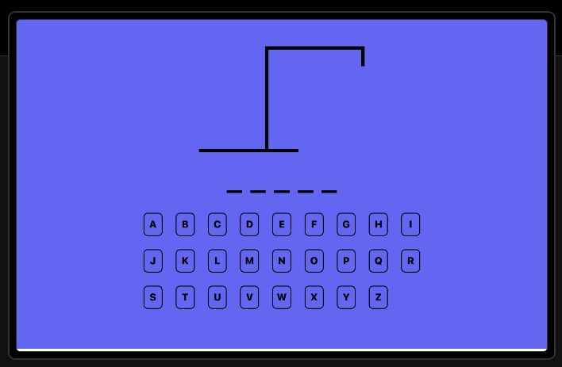

# TypeScript Hangman Game

### About
This is a simple implementation of the classic Hangman game using TypeScript. The game randomly selects a word from a pre-defined list of words, and the player has to guess the letters in the word before making too many incorrect guesses.

### Features
Random word selection 
Graphic representation of the Hangman 
Incorrect guesses counter 
Win/Lose conditions 
Sound effects

### How to Play
Clone or download the repository 
Install dependencies with `npm install` 
Start the game with `npm run dev` 
Guess the letters in the word before the Hangman is fully drawn
Have fun! 

### Technologies Used
React 
TypeScript 
Tailwindcss 
Vite

### Screenshot

